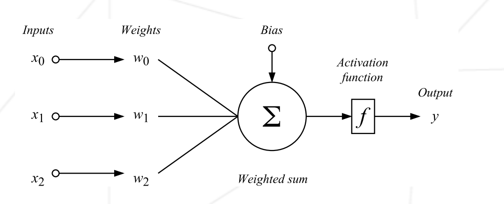

# Multilayer Perceptron (MLP) – Adım Adım Matematiksel Gösterim

Bu doküman, MLP matematiğini He initialization’dan başlayıp ileri yayılım, loss, geri yayılım, gradyan ve güncelleme adımlarına kadar **tek bir zincir** halinde anlatır.

Amaç: Kod ezberi değil; matrislerin nereden geldiğini, nasıl çarpıldığını ve neden o şekilde güncellendiğini net göstermek.

---

## 0) Senaryo ve Mimari

Bu dokümanda hesap kolaylığı için küçük bir ağ kullanıyoruz:

- Input feature sayısı: 3
- Hidden layer: 2 nöron (ReLU)
- Output layer: 2 sınıf (Softmax)
- Mini-batch size: 2

Yani:

```text
layer_size = [3, 2, 2]
```

---

## 1) He Uniform Initialization

Amaç: Ağırlıkları öyle bir aralıkta başlatmak ki, ileri ve geri yayılımda (forward/backprop) değerler çok büyüyüp patlamasın veya çok küçülüp kaybolmasın.
Formül:

$$
W^l \sim U\left(-\sqrt{\frac{6}{\mathrm{fan\_in}}}, +\sqrt{\frac{6}{\mathrm{fan\_in}}}\right),
\qquad
b^l = 0
$$

Burada `fan_in`, ilgili katmana giren nöron sayısıdır.

### Bu ağ için limitler

$$
\mathrm{limit}_1 = \sqrt{\frac{6}{3}} = \sqrt{2} \approx 1.4142,
\qquad
\mathrm{limit}_2 = \sqrt{\frac{6}{2}} = \sqrt{3} \approx 1.7320
$$

Örnek başlangıç değerleri:

$$
W^1 =
\begin{bmatrix}
0.60 & -0.20 \\
-0.10 & 0.50 \\
1.20 & -0.70
\end{bmatrix},
\quad
b^1 = \begin{bmatrix}0 & 0\end{bmatrix}
$$

$$
W^2 =
\begin{bmatrix}
0.40 & -0.30 \\
0.20 & 0.10
\end{bmatrix},
\quad
b^2 = \begin{bmatrix}0 & 0\end{bmatrix}
$$

---

## 2) Mini-Batch ve Etiketler


Makine öğrenmesi ve derin öğrenmede mini-batch, eğitim verilerinin küçük gruplara bölünerek işlenmesi yöntemidir.
- Dataset: Tüm örneklerin bulunduğu büyük veri kümesi (örneğin WDBC’de 569 örnek × 30 feature).
- Batch size: Eğitim sırasında aynı anda işlenecek örnek sayısı (örneğin 16, 32, 64).
- Mini-batch: Dataset’ten seçilen bu küçük grup.

Mantığı
- Tüm veriyi tek seferde işlemek (batch gradient descent) hem yavaş hem de bellek açısından zor olabilir.
- Tek örnekle (stochastic gradient descent) çalışmak ise çok gürültülü ve dengesizdir.
- Mini-batch gradient descent bu ikisinin ortasını bulur:
- Her adımda küçük bir grup örnek alınır.
- Bu grup üzerinden forward pass (çıktı hesaplama) ve backward pass (gradyan hesaplama) yapılır.
- Parametreler güncellenir, sonra sıradaki mini-batch’e geçilir.

WDBC Örneği
- Feature matrisi (X): `16 × 30` boyutunda (16 örnek, her biri 30 feature).
- Etiket matrisi (Y): `16 × 2` boyutunda (diagnosis sütunu one-hot encode edilmiş: `[1,0] = Malignant`, `[0,1] = Benign`).

Örnek:

$$
X_{batch} = \begin{bmatrix}
x_{1,1} & x_{1,2} & \dots & x_{1,30} \\
x_{2,1} & x_{2,2} & \dots & x_{2,30} \\
\vdots & \vdots & \ddots & \vdots \\
x_{16,1} & x_{16,2} & \dots & x_{16,30}
\end{bmatrix} \in \mathbb{R}^{16\times 30}
$$

One-hot etiketler:

$$
Y_{batch} = \begin{bmatrix}
1 & 0 \\
0 & 1 \\
\vdots & \vdots \\
1 & 0
\end{bmatrix} \in \{0,1\}^{16\times 2}
$$

---

## 3) Forward Propagation

### Step 1 — Weighted Sum

$$
Z = XW + b
$$

Where:

- $X \in \mathbb{R}^{(\mathrm{batch\_size},\,\mathrm{input\_size})}$
- $W \in \mathbb{R}^{(\mathrm{input\_size},\,\mathrm{output\_size})}$
- $b \in \mathbb{R}^{(1,\,\mathrm{output\_size})}$

Result:

$$
Z \in \mathbb{R}^{(\mathrm{batch\_size},\,\mathrm{output\_size})}
$$

### Example (shape)

If:

- Batch size = 8
- Input size = 4
- Hidden neurons = 5

Then:

```text
X  = (8,4)
W1 = (4,5)
b1 = (1,5)
Z1 = X @ W1 + b1 -> (8,5)
```

---

### Worked small example — explicit dot products (bizim zincir)

Burada:

```text
X  = [[ 0.50,  1.20, -0.30],
      [ 1.00, -0.40,  0.80]]        # (2,3)

W1 = [[ 0.60, -0.20],
      [-0.10,  0.50],
      [ 1.20, -0.70]]               # (3,2)

b1 = [[0.00, 0.00]]                  # (1,2)
```

#### Dot-product: 1. satır (1. örnek)

- Hidden nöron 1 (1. sütun):

$$
0.50\cdot0.60 + 1.20\cdot(-0.10) + (-0.30)\cdot1.20 = -0.18
$$

- Hidden nöron 2 (2. sütun):

$$
0.50\cdot(-0.20) + 1.20\cdot0.50 + (-0.30)\cdot(-0.70) = 0.71
$$

Bias eklenince: $[-0.18,\,0.71] + [0,0] = [-0.18,\,0.71]$

#### Dot-product: 2. satır (2. örnek)

- Hidden nöron 1:

$$
1.00\cdot0.60 + (-0.40)\cdot(-0.10) + 0.80\cdot1.20 = 1.60
$$

- Hidden nöron 2:

$$
1.00\cdot(-0.20) + (-0.40)\cdot0.50 + 0.80\cdot(-0.70) = -0.96
$$

Bias eklenince: $[1.60,\,-0.96] + [0,0] = [1.60,\,-0.96]$

Final pre-activation:

$$
Z^1 =
\begin{bmatrix}
-0.18 & 0.71 \\
1.60 & -0.96
\end{bmatrix}
$$

---

### Step 2 — Activation (ReLU)
Amaç: ReLU (Rectified Linear Unit) negatif değerleri 0 yapıp pozitif değerleri aynı bırakarak doğrusal olmayanlık (nonlinearity) ekler; böylece ağ lineer olmayan karar sınırları öğrenebilir.

$$
A^1 = \mathrm{ReLU}(Z^1) = \max(0, Z^1)
$$

$$
A^1 =
\begin{bmatrix}
0.00 & 0.71 \\
1.60 & 0.00
\end{bmatrix}
$$


---

### Step 3 — Output Weighted Sum


**Aktivasyon Sonrası Geçişin Mantığı:**
İlk katmanda giriş verileri X ağırlıklarla $W^1$ çarpılıp bias $b^1$ eklenerek $Z^1$ elde edilir. Bu hâl hâlâ doğrusal bir dönüşümdür. Aktivasyon fonksiyonu (örneğin ReLU) uygulanarak $A^1$ üretilir; bu adım modele doğrusal olmayanlık katar ve verilerin daha karmaşık ilişkilerini öğrenmesini sağlar.
Sonraki adımda $A^1$, bir sonraki katmanın girişidir. Bu yüzden $A^1$ tekrar yeni ağırlıklarla $W^2$ çarpılır ve bias $b^2$ eklenir. Böylece her katman kendi ağırlıklarını öğrenir ve veriyi farklı bir temsil düzeyine dönüştürür. Katmanlar arası bu zincir sayesinde ağ, basit özelliklerden başlayarak daha soyut ve güçlü karar sınırlarına ulaşır.


$$
Z^2 = A^1W^2 + b^2
$$

```text
A1 = [[0.00, 0.71],
      [1.60, 0.00]]                 # (2,2)

W2 = [[ 0.40, -0.30],
      [ 0.20,  0.10]]               # (2,2)

b2 = [[0.00, 0.00]]                  # (1,2)
```

Hesap:

- 1. örnek:
  - $z_{11} = 0.00\cdot0.40 + 0.71\cdot0.20 = 0.142$
  - $z_{12} = 0.00\cdot(-0.30) + 0.71\cdot0.10 = 0.071$
- 2. örnek:
  - $z_{21} = 1.60\cdot0.40 + 0.00\cdot0.20 = 0.640$
  - $z_{22} = 1.60\cdot(-0.30) + 0.00\cdot0.10 = -0.480$

$$
Z^2 =
\begin{bmatrix}
0.142 & 0.071 \\
0.640 & -0.480
\end{bmatrix}
$$

---

### Step 4 — Softmax (olasılığa dönüşüm)

$$
\hat{y}_i = \frac{e^{z_i}}{\sum_j e^{z_j}}
$$

Uygulamada softmax her bir örnek (satır) için ayrı ayrı uygulanır — yani satır bazında
normalize edilir. Sayısal kararlılık için her satırdan o satırın maksimumu
çıkarılır (böylece büyük pozitif/negatif değerlere karşı exp() taşması engellenir):

$$
\hat{y}_i = \frac{e^{z_i - z_{\max}}}{\sum_j e^{z_j - z_{\max}}}
$$

Adım adım (bizim örneğe göre):

$$
Z^2 =
\begin{bmatrix}
0.142 & 0.071 \\
0.640 & -0.480
\end{bmatrix}
$$

- 1. örnek: $Z^{2}_{(1)} = [0.142,\;0.071]$.
      - $z_{\max}=0.142 \Rightarrow [0,\;-0.071]$,
      - $e^{[0,-0.071]} \approx [1.0000,\;0.9314]$,
      - toplam $=1.9314$,
      - softmax $= [1/1.9314,\;0.9314/1.9314] \approx [0.5177,\;0.4823]$.

- 2. örnek: $Z^{2}_{(2)} = [0.640,\;-0.480]$.
      - $z_{\max}=0.640 \Rightarrow [0,\;-1.120]$,
      - $e^{[0,-1.120]} \approx [1.0000,\;0.3250]$,
      - toplam $=1.3250$,
      - softmax $= [1/1.3250,\;0.3250/1.3250] \approx [0.7541,\;0.2459]$.


Sonuç:

$$
\hat{Y} =
\begin{bmatrix}
0.5177 & 0.4823 \\
0.7541 & 0.2459
\end{bmatrix}
$$

---


## 4) Cross-Entropy Loss

Formül (mini-batch için ortalama):

$$
L = -\frac{1}{m}\sum_{k=1}^{m}\sum_{c=1}^{C} y_{k,c}\log(\hat{y}_{k,c})
$$

Bu, bir önceki softmax çıktısının modelin ne kadar yanıldığını ölçmek için kullanılır.
Doğru sınıfın olasılığı ne kadar düşükse, ceza (loss) o kadar büyük olur.
Eğitim sırasında bu loss minimize edilerek modelin doğruluğu artırılır.

$$
\hat{Y}=
\begin{bmatrix}
0.5177 & 0.4823 \\
0.7541 & 0.2459
\end{bmatrix},
\qquad
Y=
\begin{bmatrix}
1 & 0 \\
0 & 1
\end{bmatrix}
$$

Adım adım (aynı örneğin devamı):

1) Örnek başına loss:

$$
L_k=-\sum_{c=1}^{C}y_{k,c}\log(\hat{y}_{k,c})
$$

- 1. örnek için $Y_1=[1,0]$:

$$
L_1=-(1\cdot\log(0.5177)+0\cdot\log(0.4823))=-\log(0.5177)=0.6584
$$

- 2. örnek için $Y_2=[0,1]$:

$$
L_2=-(0\cdot\log(0.7541)+1\cdot\log(0.2459))=-\log(0.2459)=1.4029
$$

2) Mini-batch ortalaması ($m=2$):

$$
L=\frac{L_1+L_2}{2}=\frac{0.6584+1.4029}{2}=1.0307
$$

Yani bu batch için modelin ortalama hatası **1.0307**'dir.

Not: softmax + cross-entropy birlikte kullanıldığında (ve doğru one-hot
formatında verildiğinde) çıktı delta'sı sadeleşir ve geri yayılımda pratik olarak
$$\delta = \hat{Y} - Y$$
kullanılır


---

## 5) Backpropagation

### Step 1 — Output delta

Amaç: Çıkış katmanındaki hatayı (tahmin - gerçek) bulup geriye taşımak.
Softmax + Cross-Entropy birlikte kullanıldığında türev sadeleşir:

$$
\delta^2 = \hat{Y} - Y
$$

Burada:

$$
\hat{Y}=
\begin{bmatrix}
0.5177 & 0.4823 \\
0.7541 & 0.2459
\end{bmatrix},
\qquad
Y=
\begin{bmatrix}
1 & 0 \\
0 & 1
\end{bmatrix}
$$

Satır satır çıkarma:

- 1. örnek: $[0.5177,\;0.4823]-[1,\;0]=[-0.4823,\;0.4823]$
- 2. örnek: $[0.7541,\;0.2459]-[0,\;1]=[0.7541,\;-0.7541]$

$$
\delta^2 =
\begin{bmatrix}
-0.4823 & 0.4823 \\
0.7541 & -0.7541
\end{bmatrix}
$$


### Step 2 — Hidden delta

Amaç: Çıkıştaki hatanın hidden katmana ne kadar yansıdığını bulmak.

Formül:

$$
\delta^1 = (\delta^2 (W^2)^T) \odot \mathrm{ReLU}'(Z^1)
$$

$\delta^2$'miz$

$$
\delta^2 =
\begin{bmatrix}
-0.4823 & 0.4823 \\
0.7541 & -0.7541
\end{bmatrix}
$$


$W^2$:

$$
W^2 =
\begin{bmatrix}
0.40 & -0.30 \\
0.20 & 0.10
\end{bmatrix}
$$

Transpoz sonrası $W^2$:

$$
(W^2)^T =
\begin{bmatrix}
0.40 & 0.20 \\
-0.30 & 0.10
\end{bmatrix}
$$

Peki neden transpose alıyoruz?

- İleri yayılımda: $Z^2 = A^1W^2 + b^2$
- Geri yayılımda hata hidden'a dönerken: $\delta^2$ ile $W^2$'nin ters yönlü etkisi gerekir, bu yüzden $(W^2)^T$ kullanılır.

Ara çarpımın açık hesabı:

- 1. örnek, 1. hidden nöron:

$$
(-0.4823)\cdot0.40 + (0.4823)\cdot(-0.30) = -0.3376
$$

- 1. örnek, 2. hidden nöron:

$$
(-0.4823)\cdot0.20 + (0.4823)\cdot0.10 = -0.0482
$$

- 2. örnek, 1. hidden nöron:

$$
(0.7541)\cdot0.40 + (-0.7541)\cdot(-0.30) = 0.5279
$$

- 2. örnek, 2. hidden nöron:

$$
(0.7541)\cdot0.20 + (-0.7541)\cdot0.10 = 0.0754
$$

$$
\delta^2 (W^2)^T =
\begin{bmatrix}
-0.3376 & -0.0482 \\
0.5279 & 0.0754
\end{bmatrix}
$$

ReLU türevi maskesi ($Z^1$ üzerinden):

$$
\mathrm{ReLU}'(Z^1)=
\begin{bmatrix}
0 & 1 \\
1 & 0
\end{bmatrix}
$$

Bu maskenin anlamı:

- $Z^1 > 0$ olan yerde türev 1, yani hata geçer.
- $Z^1 \le 0$ olan yerde türev 0, yani hata kesilir.

Hadamard çarpımı(eleman eleman çarpım):

$$
\delta^1 =
\begin{bmatrix}
0.0000 & -0.0482 \\
0.5279 & 0.0000
\end{bmatrix}
$$

Kısa yorum:

- 1. örnekte 1. hidden nöronun $Z^1$ değeri negatif olduğu için gradyan 0'a kesildi.
- 2. örnekte 2. hidden nöronun $Z^1$ değeri negatif olduğu için gradyan 0'a kesildi.
- Bu davranış ReLU'nun geri yayılımdaki temel etkisidir.

---

## 6) Gradient Hesabı

Genel formüller:

$$
\nabla W^l = \frac{(A^{l-1})^T\delta^l}{m_b},
\qquad
\nabla b^l = \frac{\sum \delta^l}{m_b}
$$

### Output layer gradient

Amaç:
- Backpropagation’da $\delta$ ile hatayı bulduk.
- Ama bu hata tek başına yetmez; ağırlıkların ve biasların nasıl güncelleneceğini bilmemiz lazım.
- Bunun için loss fonksiyonunun ağırlıklara ve biaslara göre türevini (gradyanını) hesaplıyoruz.
- Gradyan bize “hangi yönde ve ne kadar güncelleme yapmalıyız” bilgisini verir.

Kullandığımız değerler:

$$
A^1=
\begin{bmatrix}
0.00 & 0.71 \\
1.60 & 0.00
\end{bmatrix},
$$

$$
\delta^2=
\begin{bmatrix}
-0.4823 & 0.4823 \\
0.7541 & -0.7541
\end{bmatrix}
$$

Önce transpoz:

$$
(A^1)^T=
\begin{bmatrix}
0.00 & 1.60 \\
0.71 & 0.00
\end{bmatrix}
$$

Çarpım:

$$
(A^1)^T\delta^2=
\begin{bmatrix}
1.2066 & -1.2066 \\
-0.3424 & 0.3424
\end{bmatrix}
$$

Eleman bazında örnek:

- $(1,1)$ elemanı: $0.00\cdot(-0.4823) + 1.60\cdot0.7541 = 1.2066$
- $(2,1)$ elemanı: $0.71\cdot(-0.4823) + 0.00\cdot0.7541 = -0.3424$

Weight gradyanı için aktivasyon katmanının transpozunu alırız, delta ile çarparız, sonra batch size’e böleriz.

$$ dW^2 = \frac{(A^1)^T\delta^2}{2} = 
\begin{bmatrix}
0.6033 & -0.6033 \\
-0.1712 & 0.1712
\end{bmatrix}
$$

Bias gradyanı için $\delta$ değerlerini toplayıp batch'e böleriz:

$$
\sum \delta^2 =
\begin{bmatrix}
(-0.4823+0.7541) & (0.4823-0.7541)
\end{bmatrix} =
\begin{bmatrix}
0.2718 & -0.2718
\end{bmatrix}
$$

$$
db^2 = \frac{\sum \delta^2}{2}
= \begin{bmatrix}0.1359 & -0.1359\end{bmatrix}
$$


### Hidden layer gradient

Amaç: İlk katman ($W^1,b^1$) için gradyanları bulmak.

Kullandığımız değerler:

$$
X=
\begin{bmatrix}
0.50 & 1.20 & -0.30 \\
1.00 & -0.40 & 0.80
\end{bmatrix},
\qquad
\delta^1=
\begin{bmatrix}
0.0000 & -0.0482 \\
0.5279 & 0.0000
\end{bmatrix}
$$

Önce transpoz:

$$
X^T=
\begin{bmatrix}
0.50 & 1.00 \\
1.20 & -0.40 \\
-0.30 & 0.80
\end{bmatrix}
$$

Çarpım:

$$
X^T\delta^1=
\begin{bmatrix}
0.5279 & -0.0241 \\
-0.2112 & -0.0578 \\
0.4223 & 0.0145
\end{bmatrix}
$$

Eleman bazında örnek:

- $(1,1)$ elemanı: $0.50\cdot0.0000 + 1.00\cdot0.5279 = 0.5279$
- $(1,2)$ elemanı: $0.50\cdot (-0.0482)+1.00\cdot 0.0000=-0.0241$
- ...
- $(3,1)$ elemanı: $(-0.30)\cdot 0.0000+0.80\cdot 0.5279=0.4223$
- $(3,2)$ elemanı: $(-0.30)\cdot(-0.0482) + 0.80\cdot0.0000 = 0.0145$

$$
dW^1 = \frac{X^T\delta^1}{2}=
\begin{bmatrix}
0.2639 & -0.0120 \\
-0.1056 & -0.0289 \\
0.2112 & 0.0072
\end{bmatrix}
$$

Bias gradyanı:

$$
\sum \delta^1 =
\begin{bmatrix}
(0.0000+0.5279) & (-0.0482+0.0000)
\end{bmatrix}=
\begin{bmatrix}
0.5279 & -0.0482
\end{bmatrix}
$$

$$
db^1 = \frac{\sum \delta^1}{2}
= \begin{bmatrix}0.2639 & -0.0241\end{bmatrix}
$$

---

## 7) Parametre Güncelleme (Gradient Descent)
Son adımda, bir önceki bölümde bulduğumuz gradyanları kullanarak
ağırlık ve bias değerlerini güncelliyoruz.

Basit fikir:

- Gradyan pozitifse: o parametreyi biraz azaltırız.
- Gradyan negatifse: o parametreyi biraz artırırız.
- Ne kadar değişeceğini learning rate belirler.

Genel formül:

$$
W^l \leftarrow W^l - \eta\,dW^l,
\qquad
b^l \leftarrow b^l - \eta\,db^l
$$

Bu örnekte (öğrenme oranı):

$$
\eta = 0.05
$$

### 7.1) Output layer güncellemesi ($W^2, b^2$)

Eski değerler:

$$
W^2=
\begin{bmatrix}
0.40 & -0.30 \\
0.20 & 0.10
\end{bmatrix},
\qquad
b^2=\begin{bmatrix}0 & 0\end{bmatrix}
$$

Gradyanlar:

$$
dW^2=
\begin{bmatrix}
0.6033 & -0.6033 \\
-0.1712 & 0.1712
\end{bmatrix},
\qquad
db^2=\begin{bmatrix}0.1359 & -0.1359\end{bmatrix}
$$

Eleman bazında güncelleme:

- $w^2_{11,new} = 0.40 - 0.05\cdot0.6033 = 0.3698$
- $w^2_{12,new} = -0.30 - 0.05\cdot(-0.6033) = -0.2698$
- $w^2_{21,new} = 0.20 - 0.05\cdot(-0.1712) = 0.2086$
- $w^2_{22,new} = 0.10 - 0.05\cdot0.1712 = 0.0914$

- $b^2_{1,new} = 0 - 0.05\cdot0.1359 = -0.0068$
- $b^2_{2,new} = 0 - 0.05\cdot(-0.1359) = 0.0068$

Sonuç:

$$
W^2_{new} =
\begin{bmatrix}
0.3698 & -0.2698 \\
0.2086 & 0.0914
\end{bmatrix},
\quad
b^2_{new} = \begin{bmatrix}-0.0068 & 0.0068\end{bmatrix}
$$

### 7.2) Hidden layer güncellemesi ($W^1, b^1$)

Eski değerler:

$$
W^1=
\begin{bmatrix}
0.60 & -0.20 \\
-0.10 & 0.50 \\
1.20 & -0.70
\end{bmatrix},
\qquad
b^1=\begin{bmatrix}0 & 0\end{bmatrix}
$$

Gradyanlar:

$$
dW^1=
\begin{bmatrix}
0.2639 & -0.0120 \\
-0.1056 & -0.0289 \\
0.2112 & 0.0072
\end{bmatrix},
\qquad
db^1=\begin{bmatrix}0.2639 & -0.0241\end{bmatrix}
$$

Eleman bazında örnek güncelleme:

- $w^1_{11,new} = 0.60 - 0.05\cdot0.2639 = 0.5868$
- $w^1_{12,new} = -0.20 - 0.05\cdot(-0.0120) = -0.1994$
- $w^1_{31,new} = 1.20 - 0.05\cdot0.2112 = 1.1894$
- $w^1_{32,new} = -0.70 - 0.05\cdot0.0072 = -0.7004$

- $b^1_{1,new} = 0 - 0.05\cdot0.2639 = -0.0132$
- $b^1_{2,new} = 0 - 0.05\cdot(-0.0241) = 0.0012$

Sonuç:

$$
W^1_{new} =
\begin{bmatrix}
0.5868 & -0.1994 \\
-0.0947 & 0.5014 \\
1.1894 & -0.7004
\end{bmatrix},
\quad
b^1_{new} = \begin{bmatrix}-0.0132 & 0.0012\end{bmatrix}
$$

Kısa özet:

- Adım 5-6'da gradyanlar bulundu.
- Adım 7'de bu gradyanlar ile parametreler güncellendi.
- Sonraki mini-batch'te model bu yeni parametrelerle ileri yayılım yapar.

---

