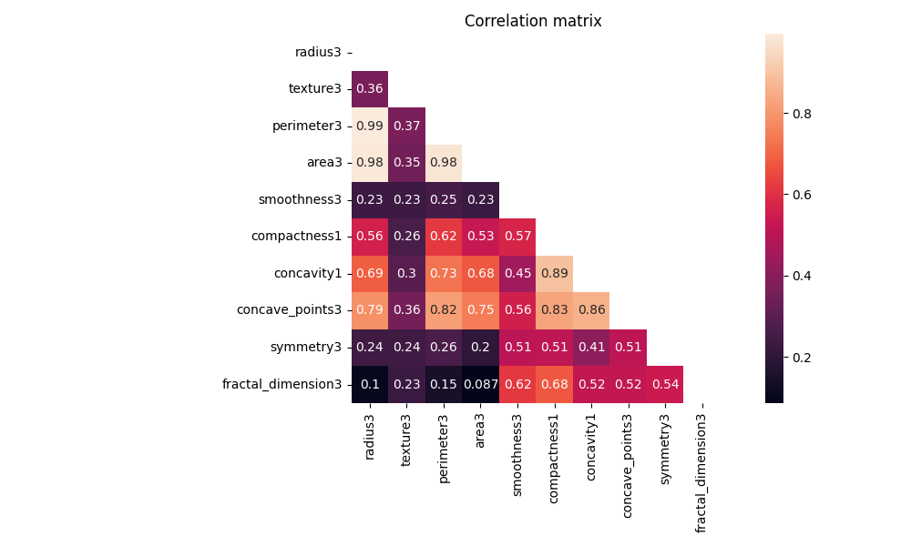
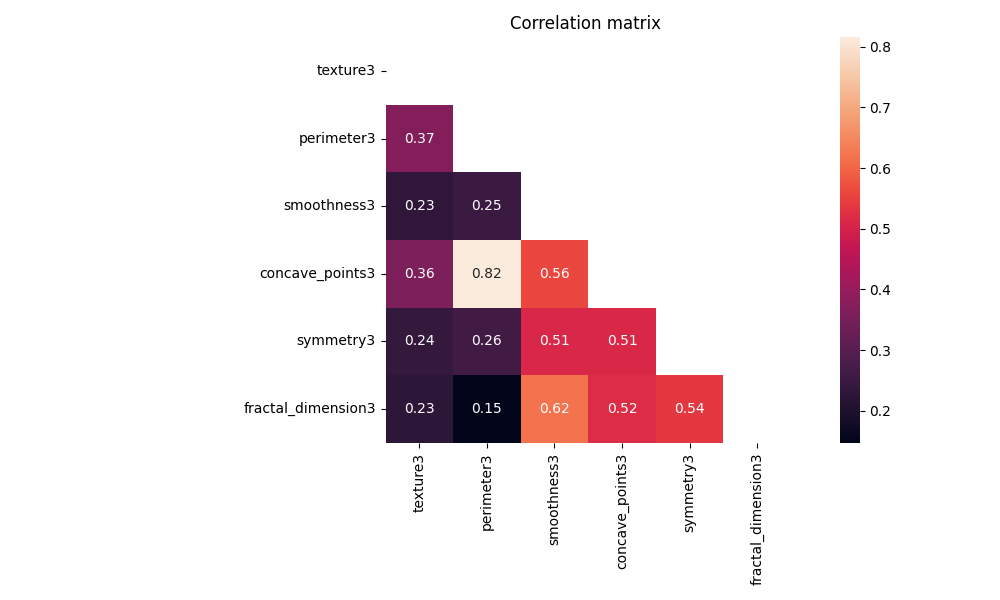
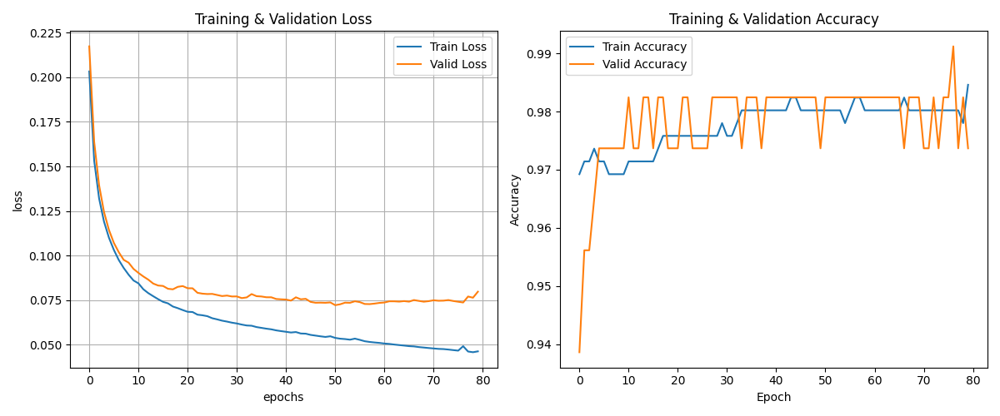

# Multilayer Perceptron

## Introduction

This project builds a Multilayer Perceptron (MLP) from scratch with NumPy to classify breast tumors (benign / malignant) using the Wisconsin Diagnostic Breast Cancer (WDBC) dataset.

For mathematical foundations and worked examples, see [Math.md](Math.md).

---

## Dataset

**Wisconsin Diagnostic Breast Cancer (WDBC)**

- 569 samples
- 30 numeric features + 1 target (`diagnosis`)
- No missing values
- Class distribution: 357 benign, 212 malignant
- Split: 80% train / 20% validation (stratified)

### Why `radius1`, `radius2`, `radius3` are important
Each base feature (radius, texture, perimeter, area, ...) appears in three versions:

- `*1` = **mean** value
- `*2` = **standard error (SE)**
- `*3` = **worst** value

Example:
- `radius1`: mean radius
- `radius2`: radius standard error
- `radius3`: worst radius

This naming is central to `corr_with_target()`: the function compares `[base1, base2, base3]` for each base name and picks the one most related to target.

---

## Project Flow (Step by Step)

### 1) Data loading and split
**File:** [Load_And_Analysis.py](Load_And_Analysis.py)

**Function:** `download_and_split()`

What it does:
- Downloads WDBC with `ucimlrepo` if raw data does not exist
- Encodes target (`M -> 1`, `B -> 0`)
- Creates stratified train/validation split
- Saves:
  - `data/raw/wdbc.csv`
  - `data/split/train.csv`
  - `data/split/valid.csv`

Why:
- Reproducible pipeline
- Balanced class ratio in train/validation

Output:
- Ready-to-use train and validation CSV files

### 2) Basic data analysis (EDA)
**File:** [Load_And_Analysis.py](Load_And_Analysis.py)

**Function:** `analyze()`

What it does:
- Prints shape of train features/target
- Checks missing values
- Prints class distribution and ratios
- Prints descriptive statistics

Why:
- Verifies data quality before model training

Output:
- Console summary of dataset health

### 3) Correlation-based feature filtering
**File:** [Load_And_Analysis.py](Load_And_Analysis.py)

**Functions:**
- `corr_with_target()`
- `corr_with_selected_features()`

What they do:
- Detect highly correlated feature pairs (threshold based)
- Compare feature-target relations
- Help choose one representative feature from strongly collinear groups

Why:
- Reduce redundant information
- Keep model simpler and more stable

Output:
- Candidate feature subsets and selected representatives

### 4) Correlation visualization
**File:** [plots/heatmap.py](plots/heatmap.py)

What it does:
- Draws lower-triangle correlation heatmaps for selected feature sets

Why:
- Visual validation of multicollinearity decisions

Output:
- Heatmap figures in [plots/images/image1.png](plots/images/image1.png) and [plots/images/image2.png](plots/images/image2.png)

---

## Correlation Figures

### Full candidate set (10 features)


### Final selected set (6 features)


---

## Current Selected Features

Final subset used after analysis:

- `texture3`
- `perimeter3`
- `smoothness3`
- `concave_points3`
- `symmetry3`
- `fractal_dimension3`

---

## Run Training

Default run:

```bash
python model/train.py
```

Example custom run:

```bash
python model/train.py --layer 16 16 16 --epochs 300 --batch_size 32 --learning_rate 0.01 --patience 30 --min_delta 1e-4
```

CLI arguments:

- `--layer` hidden layer sizes
- `--epochs` max epoch count
- `--batch_size` mini-batch size
- `--learning_rate` learning rate
- `--patience` early stopping patience
- `--min_delta` minimum improvement for valid loss

---

## Outputs

- Training curves (loss + accuracy) in matplotlib window
- Best model parameters in `saved_model.npz`

---

## Documentation Files

- [model/initialization-selection.md](model/initialization-selection.md)
- [model/forward-propagation-selection.md](model/forward-propagation-selection.md)
- [model/softmax-selection.md](model/softmax-selection.md)
- [model/relu-selection.md](model/relu-selection.md)
- [model/backpropagation-selection.md](model/backpropagation-selection.md)

---

